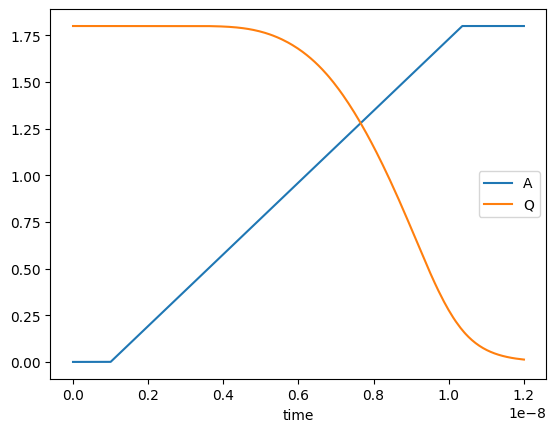

# std-cell-lib-analysis-toolkit
Collection of functions to test standard cells using python and spectre.

# Purpose

The functions provided in this repository are meant for quickly analyzing 
standard cells in regard of their timing behaviour. This is explicitly not
a full characterization environment for creating liberty files like [CharLib](https://github.com/stineje/CharLib), 
[lctime](https://codeberg.org/librecell/lctime), [libretto](https://github.com/snishizawa/libretto) 
or commercial alternatives. Instead this is intended to be used for
quick testbench creation and subsequent arc analysis in Python with minimal
setup overhead.

# Implemented functionalities

- Function and pin recognition based on an existing liberty file.
- Spice deck creation for combinatorial cells.
- Spice deck creation for sequential cells.
- Netlist generation suitable for Cadence Spectre.
- Automated simulation, value extraction and plotting.

# Dependencies

- [pyspectre](https://github.com/AugustUnderground/pyspectre)
- [liberty-parser](https://codeberg.org/tok/liberty-parser)
